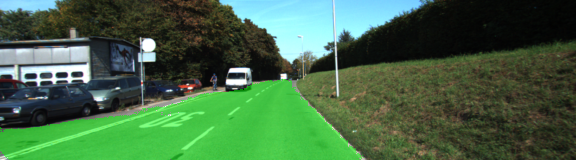
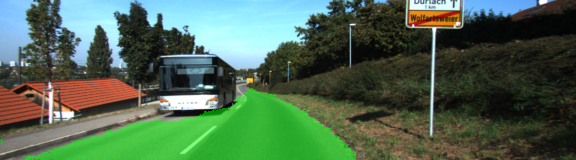
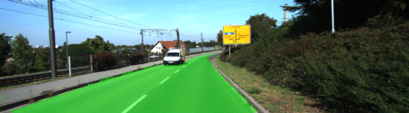
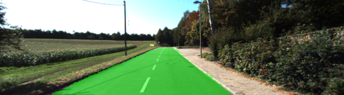
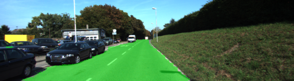
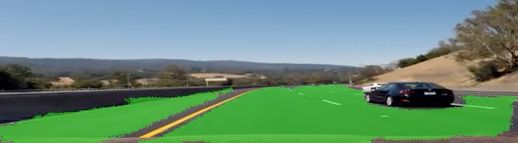
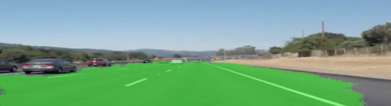

# CarND-Semantic Segmentation-Project
Self-Driving Car Engineer Nanodegree Program

## Kerem Par
<kerempar@gmail.com>


---

## Introduction
In this project, the pixels of a road in images are labeled using a Fully Convolutional Network (FCN).

---

## Setup

### Frameworks and Packages
Make sure you have the following is installed:
 - [Python 3](https://www.python.org/)
 - [TensorFlow](https://www.tensorflow.org/)
 - [NumPy](http://www.numpy.org/)
 - [SciPy](https://www.scipy.org/)

### Dataset
Download the [Kitti Road dataset](http://www.cvlibs.net/datasets/kitti/eval_road.php) from [here](http://www.cvlibs.net/download.php?file=data_road.zip).  Extract the dataset in the `data` folder.  This will create the folder `data_road` with all the training a test images.

The link for the frozen `VGG16` model is hardcoded into `helper.py`.  The model can be found [here](https://s3-us-west-1.amazonaws.com/udacity-selfdrivingcar/vgg.zip)

### Implementation
The code in the `main.py` module indicated by the "TODO" comments were implemented. The optional task involving applying the model to a video and indicated with "OPTIONAL" was also implemented. 
  
### Submission

The following files were submitted:

 1.  `helper.py`
 2.  `main.py`
 3.  `project_tests.py`
 4. Newest inference images from `runs` folder  (**all images from the most recent run**)
 5. Videos that the segmentation implementation was applied.

### Run
Run the following command to run the project:
```
python main.py
```

---

## Details

### Building the Neural Network

The project loads the pretrained vgg model. It is implemented in the function `load_vgg`.

The project learns the correct features from the images. It is implemented in the function `layers`. Skip-layers and upsampling were applied. An `L2 regularizer` was also used to prevent weights from becoming too large and being error prone to overfitting and produce garbage.

The project optimizes the neural network. It is implemented in the function `optimize`.

The project train the neural network. It is implemented in the function `train_nn`. The loss of the network is printed while the network is training.

---

## Neural Network Training

It is observed that the following conditions are met during the tests:

On average, the model decreases loss over time. It steadily decreases up to an average of  `0.04` level during the training with `70` epochs.

The number of epochs is set to `70` and batch size is set to `5`. These hyperparameters were decided manually. The number of epochs `40`, `50` and `60` were also tested and since it was observed that loss still decreases, finally it was set to `70` with a reasonable training time of under one hour.

The project labels most pixels of roads close to the best solution. The model doesn't predict correctly all the images, but most of them.

The solution that is close to best was assumed to be able to label at least 80% of the road and label no more than 20% of non-road pixels as road. 

---

## Implementation Details

As the starting point the code and instructions given in `Project Walkthrough` section of the project descriptions were adapted. 

The following are sample images from the runs folder:











In addition, two videos were also included where the model was applied to videos from previous projects `Finding Lane Lines` and `Advanced Lane Lines`.The videos were generated using `VideoFileClip` library. 

The following are sample images from the videos generated:

Advanced Lane Lines video:



Finding Lane Lines video:



### Tips
- The model is not vanilla `VGG16`, but a fully convolutional version, which already contains the 1x1 convolutions to replace the fully connected layers. Please see this [forum post](https://discussions.udacity.com/t/here-is-some-advice-and-clarifications-about-the-semantic-segmentation-project/403100/8?u=subodh.malgonde) for more information.  A summary of additional points, follow. 
- The original FCN-8s was trained in stages. The authors later uploaded a version that was trained all at once to their GitHub repo.  The version in the GitHub repo has one important difference: The outputs of pooling layers 3 and 4 are scaled before they are fed into the 1x1 convolutions.  As a result, some students have found that the model learns much better with the scaling layers included. The model may not converge substantially faster, but may reach a higher IoU and accuracy. 
- When adding l2-regularization, setting a regularizer in the arguments of the `tf.layers` is not enough. Regularization loss terms must be manually added to your loss function. otherwise regularization is not implemented.
